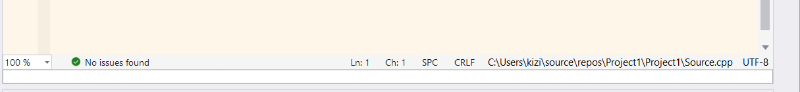

# File Utils

Show current file encoding and absolute path at the bottom of each editor, click to copy the path or change the file encoding.

**preview**

**features**

| target   | operation         | feature                                      |
| -------- | ----------------- | -------------------------------------------- |
| PATH     | Left Click        | Copy absolute path                           |
| PATH     | Right Click       | Open explorer with file selected             |
| PATH     | Ctrl + Left Click | Open cmd.exe with file path                  |
| ENCODING | Left Click        | Popup context menu, and change file encoding |

------

在编辑器底部显示文件路径和编码，同时提供复制路径，修改文件编码等操作

**功能如下**

| 触发目标 | 操作          | 功能                                                 |
| -------- | ------------- | ---------------------------------------------------- |
| 文件路径 | 左键单击      | 复制文件绝对路径                                     |
| 文件路径 | 右键单击      | 打开资源管理器，并保持文件选中                       |
| 文件路径 | CTRL+左键单击 | 在文件所在目录打开控制台                             |
| 文件编码 | 左键单击      | 弹出编码转换菜单，目前支持UTF8, UTF8-BOM和GB2312转换 |
